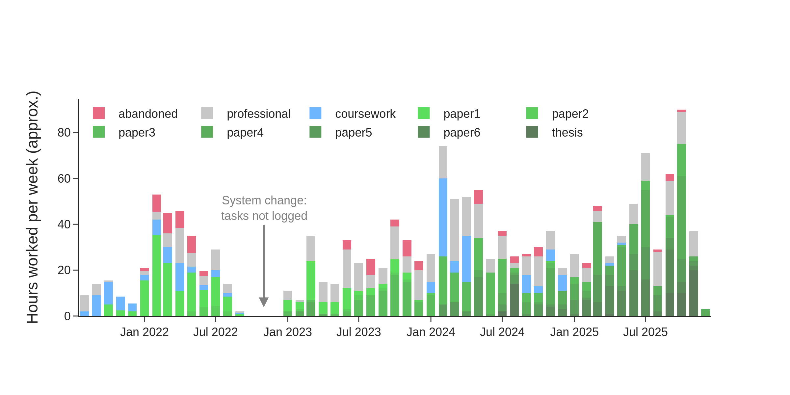
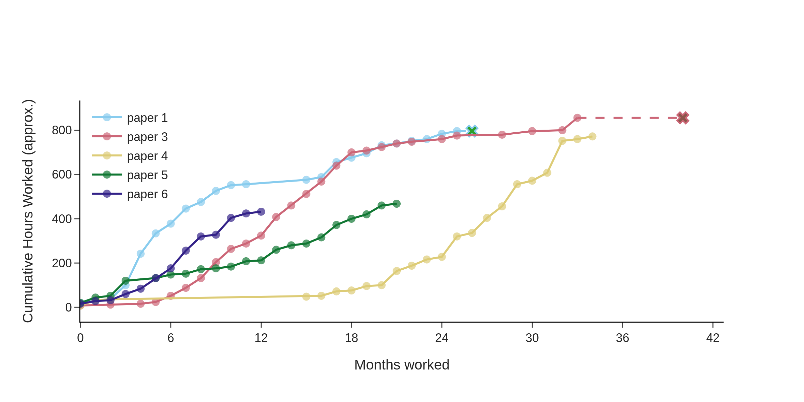

In December, I was able to complete a dream I've had since I was a child: obtaining my PhD. I successfully defended my [thesis](https://hammer.purdue.edu/articles/thesis/Accelerated_Discovery_of_Novel_Layered_Materials_using_Computational_Quantum_Mechanical_Modeling_and_Machine_Learning/30853934?file=60454859), in which I used computational quantum mechanics and machine learning to discover new atomically-thin materials. It's been quite an arduous journey to get across the finish line, and it's taken a toll on me. Consequently, I've taken some time off to focus on my health, recenter my priorities, and look towards the next steps in my career. It therefore feels right at this moment to reflect on my time in grad school. While there are many possible avenues for this reflection, here I want to reflect on the *data* collected throughout my PhD. I expect to write later on more the qualitative aspects of graduate school. Because there's a lot of data, I will be splitting this post up into two parts. This first part focuses on the manuscript-writing process, and asks the following questions:


How much time did I actually spend on manuscripts and other graduate school responsibilities?


This isn't meant to be a post about how difficult graduate school is. Rather, it's an exploration of how much of it can be measured, and what this measurement reveals. A sort of *data audit* of where I spent my time. 

There's a pervasive feeling of not doing enough that seems inseparable from graduate school. This pressure is a structural issue. While this post won't fix it, performing this data audit help me put into context the work I actually did and the time I actually spent.

First, I explored which data I have available. At the start of my PhD, I used a simple TODO list to track my tasks, with each item estimated to take one hour of focused work. As I became pulled into a dozen disparate projects, I found that a single TODO list became insufficient for this complexity and shifted to a personal scrum system. This forced me to become more reliable at estimating how much time a given task would take me, and I credit this system with keeping me organized and sane throughout grad school. I've used the estimated time for each task as the primary data source, and grouped each task into one of several categories.

|  Category      | Description |
|--------|--------|
| Coursework  | Classes, teaching, studying |
| Professional   | Conferences, seminars, applications, NSF reports, etc. |
|  Abandoned |  Research which did not yield manuscripts |
| Paper  | Research which did yield manuscripts |

While this is not a perfect metric of how many hours I worked, it is a reasonable proxy. Notably, it misses hours spent attending lectures, and I don't currently have a good way of accounting for this. The hours I've spent over the last few years, divided among these categories, are shown below as the number of hours spent per week on each project, averaged over each month of my PhD. 

In total, I recorded over 6200 hours over four years and four months. The average works out to 30 hours per week; however, this average is skewed due to the period between July 2022 and January 2023 when I was transitioning between my TODO list and my scrum system. Removing these six months, the average increases to 32 hours per week, which sounds about right by my memory. 

I initially hesitated to share this result, as some may look at this number and think I am falling short of the seemingly universal expectation of the 40-hour work week. In response, I'd first point skeptics to the months when I averaged 80-hour work weeks, such as my last semester, which contains three of my top five busiest months. The more nuanced counter is to suggest that *raw hours worked do not correlate with raw output*. I've embraced a philosophy of deep work: creating distraction-free environments where depth is rewarded and shallowness is discouraged. Shallow work, such as checking email or fracturing my attention between multiple projects, produce much less output than focused, uninterrupted sessions. Placing a high priority on deep work sessions has allowed me to produce more in less time: and rather than seeing the 80-hour work weeks as badges of honor, *I see them as failures in time management*. Deep work is difficult to cultivate, and not an infinite resource; I often found that I could only engage in 10–20 hours of deep work each week.

To me, the more interesting analysis instead lies in the percentage of time spent on each obligation. In total, I spent 60% of time on manuscripts, 10% on coursework, 25% on professional responsibilities, and 5% on abandoned projects. This 60% grew towards the end of my PhD, and mostly came from performing the research itself. While I don't have the data to determine how much was spent on manuscript-writing vs. research, I would estimate a ratio of 1:3 or so. Notably, I only worked on 1–2 papers for the first three years of my PhD, but simultaneously 4-5 in the final year and a half. This seems to be fairly typical among my peers. The 5% of my time spent on abandoned projects was low to me; I expected this to be a lot higher, as graduate school can regularly feel like a continuous stream of failures. However, knowing that only 5% of my time was spent without resulting in a manuscript was a comforting reminder that *my time in graduate school may have been more successful than I internalized*. To further analyze the manuscript-writing process, I overlaid the cumulative time spent on each manuscript, as shown below.

Here, the X indicates that the paper has been published. I additionally removed one of the papers which I showed on the previous histogram (paper 2), as I was second author on this manuscript, and it was published with only 200 hours. While this is a small sample size, it would suggest that *first-author papers take about 800 hours from start to completion, in about 30 months*. The yellow line (paper 4) is nearing submission, adding further support for this hypothesis. This is way more hours and a much longer timeline than I would have expected! Presumably, this number goes down as graduate students become more familiar with their subject and the research process, but until I publish my other manuscripts I don't have the data.

Taking this hypothesis of 800 hours as true for a moment, I did some quick back-of-the-napkin math. If PhD students are expected to write three first-author papers, as was the expectation in my group, and each paper takes 800 hours, a PhD in four years would devote 2400 to these papers alone. These would all need to be started within their first year. Extending this, if we generously assume 1200 hours on professional obligations (I logged 1600), 400 hours on coursework (I logged 600), and perform no research which is later abandoned, this sums to 4000 hours and equates to 20 hours a week. This represents a theoretical lower bound of responsibility that a perfect student, with no failed projects, would require. Coincidentally, this is the estimate which is used to determine graduate student stipends (20 hours per week). I ended up working 50% more than this, and I would venture that most graduate students I know work even more than I did. It's an unreasonable system. Even for our perfect student, there's no time left to write and defend a dissertation.