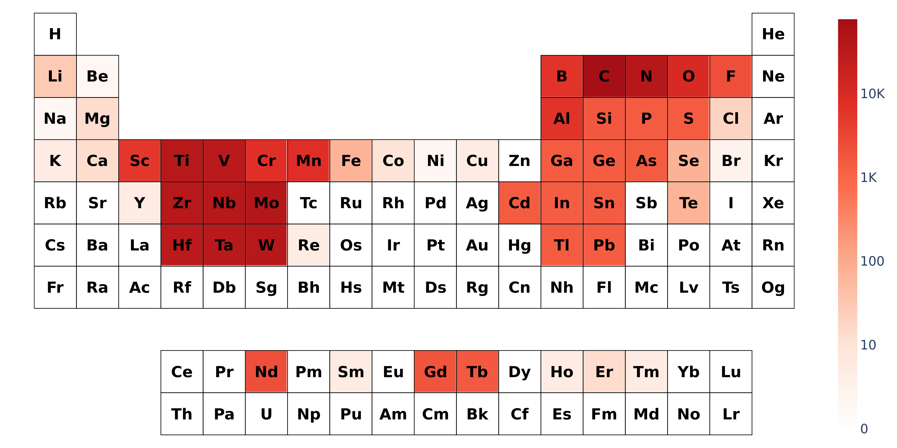
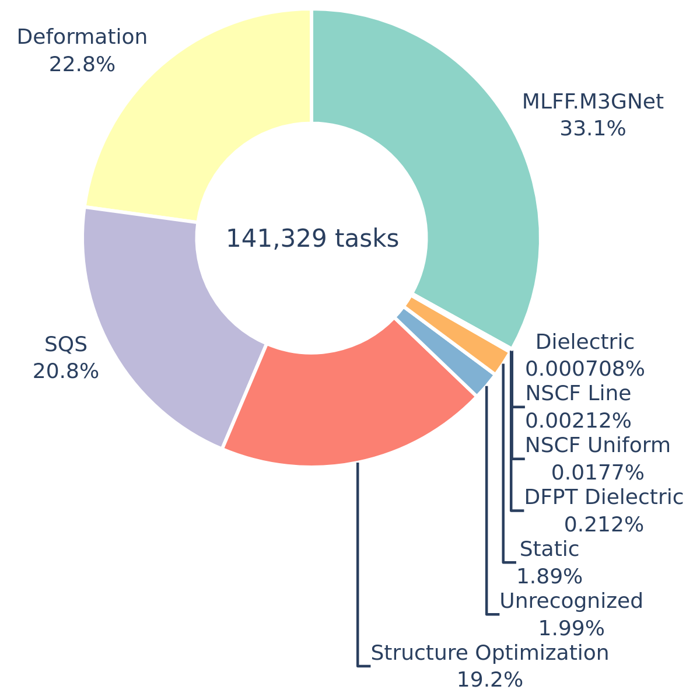

simulations - which elements did i study, how much are each of these elements in raw form to synthesize, what type of simulations did i do, how many CPU hours did i do, are simulations actually more efficient than trying to make these materials physically? cpu hours power to furnace hours

## Simulation Data

