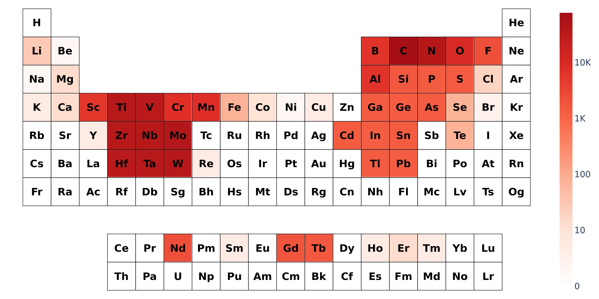
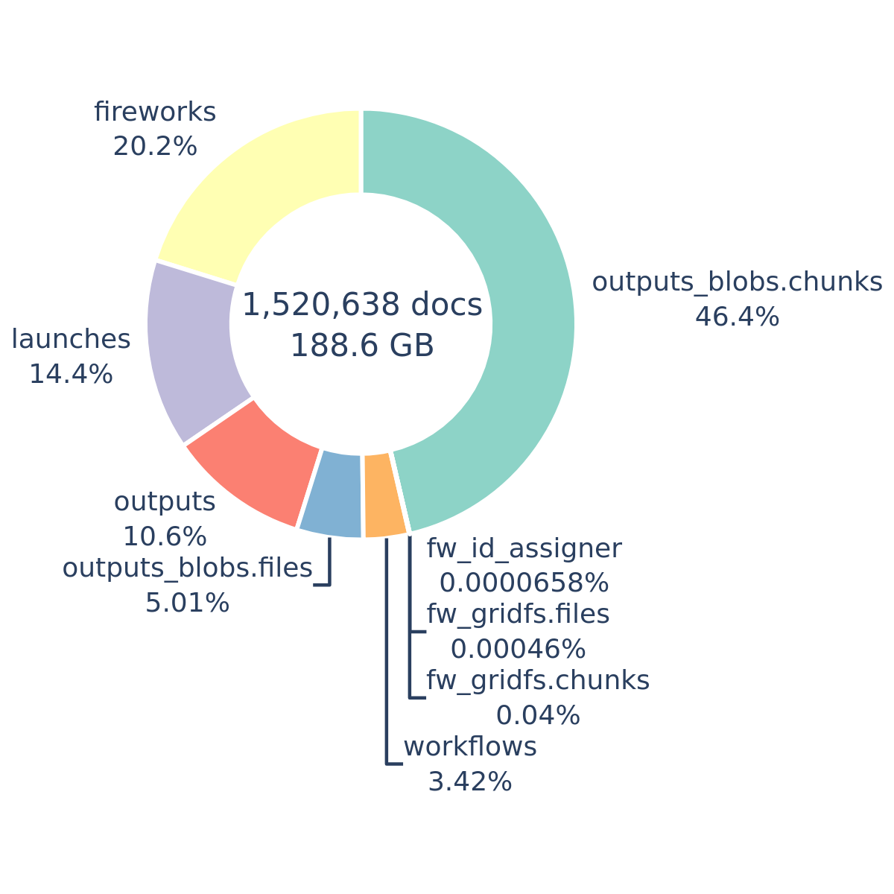
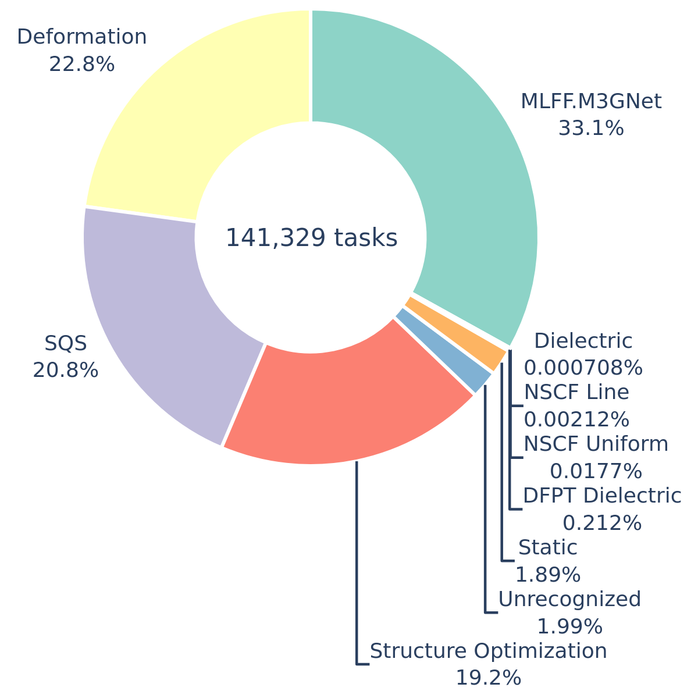

I've spent the last four years working on my PhD in Materials Engineering, and I'm thrilled to have recently defended it in front of my committee. It's been quite an arduous journey to get to the finish line. It feels right at this moment to reflect over my research the last few years. In particular, I want to reflect on the **data** collected throughout my PhD; running hundreds of thousands of simulations, tracking every task I've set for myself, and building my Zettelkasten. The last two years of my PhD have more data; as it took time to set up the systems I ended up using.

## Simulation Data

- how many slurm cores?
- how 

## Zettelkasten

- graph of everything
- 