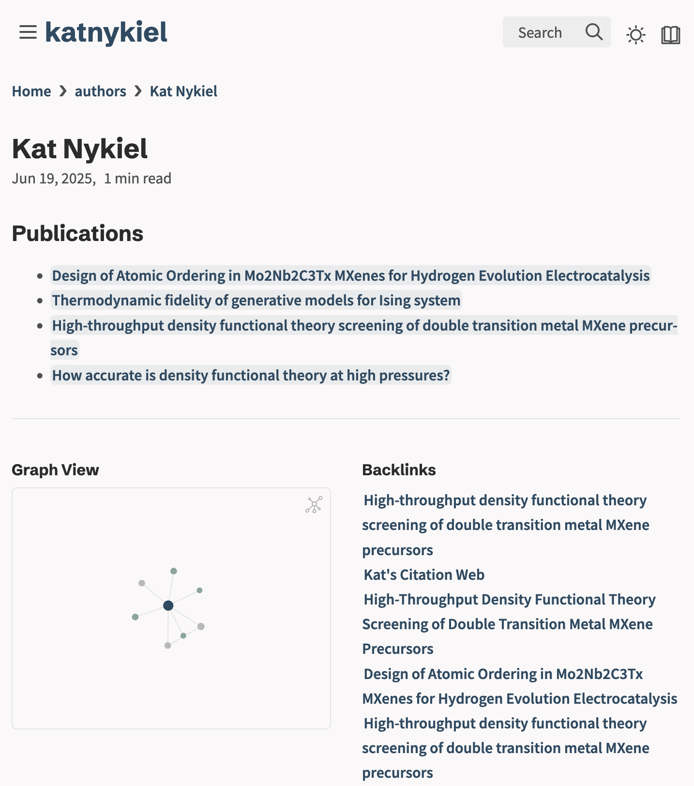
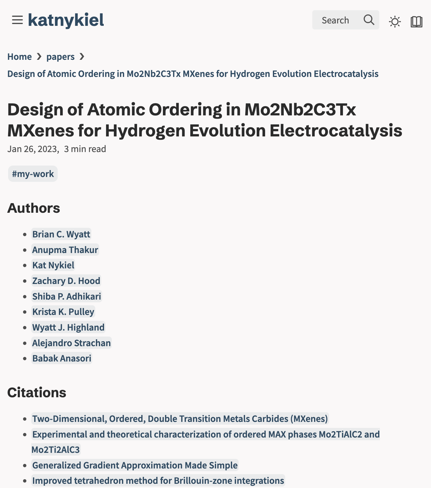
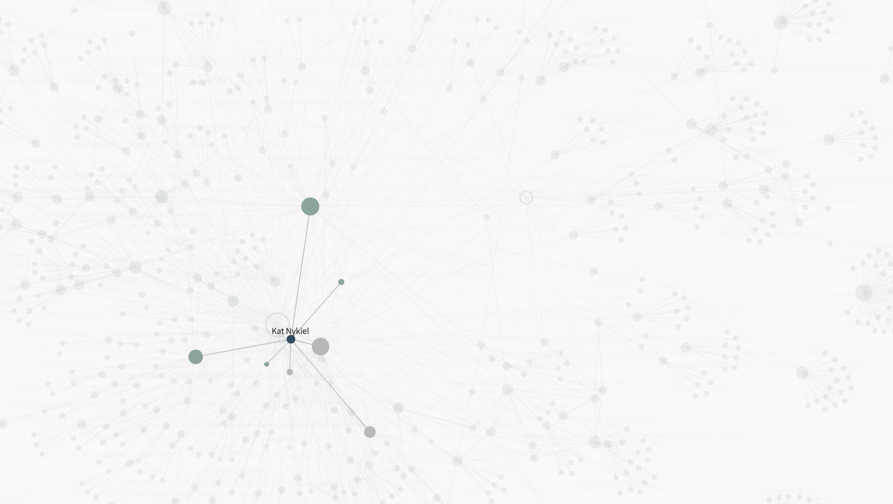

As a graduate student looking towards a career in academia, the pressure to publish highly-cited papers is omnipresent. Performing good science helps; but studying *citation patterns* seems to be an essential component to a highly-cited career. To be able to estimate the impact of a paper before having written a word seems an essential skill to build. I'm hardly the first to have this idea; the entire fields of bibliometrics and scientometrics explore this notion.

The last few months, I've been having a lot of fun playing around with [OpenAlex](https://openalex.org/), an awesome open-source catalog for scholarly work. As a very rudimentary attempt at this field of bibliometrics, I used OpenAlex's API, through [pyalex](https://github.com/J535D165/pyalex), to query the incoming and outgoing citations of my published work, as well as the authors associated with all of these works. I saved this information in a series of Markdown files (my favorite format!) for use in my local markdown system, using [vscodium](https://vscodium.com/)+[foam](https://foambubble.github.io/). A minimal version of the code to create these files is available [here](https://github.com/katnykiel/citation-web). I then used [quartz](https://quartz.jzhao.xyz/), an amazing static-site web with a focus on hypertexts, to publish these notes. 

I set up the structure of this graph so that every author has their own page listing all works that I've cited or their works which have cited mine. For example, here's mine:

Each work in this list shows the authors associated with each publication, and the citations created in that paper:

All of this is accessible through search and backlinks, but to emphasize the connection of this network, I use Quartz's graph view. It gets complicated fast!

Check out the web here: [kat's citation web](https://katnykiel.github.io/citation-web-quartz/)!