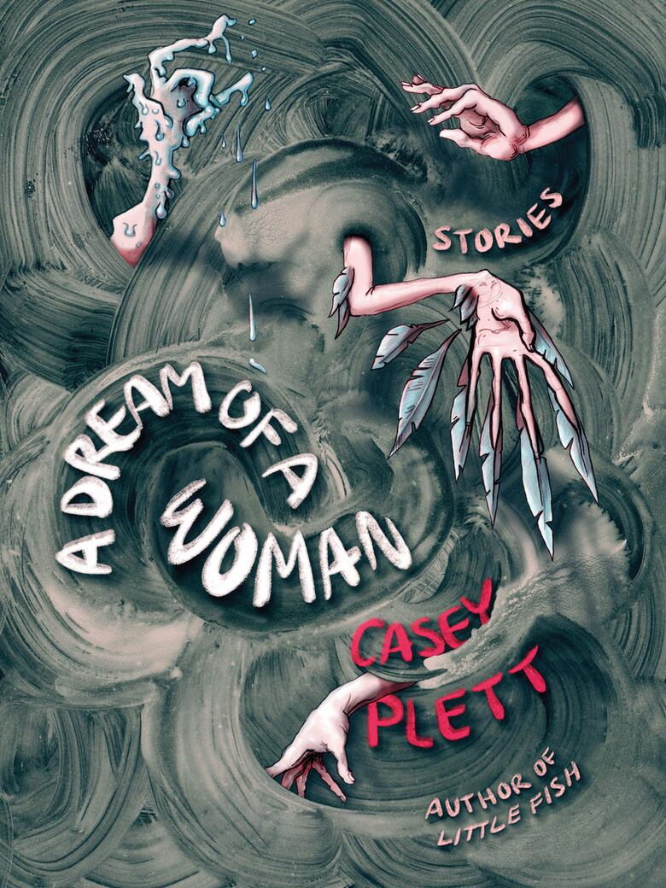
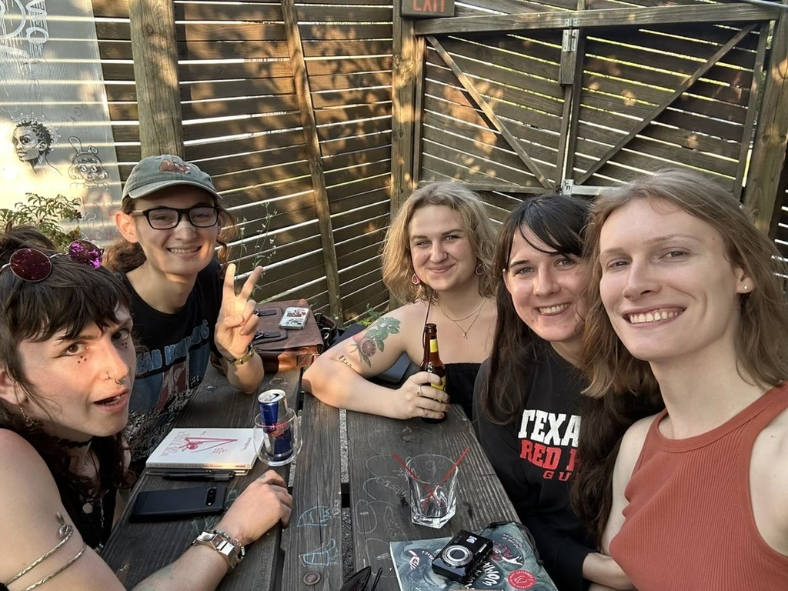
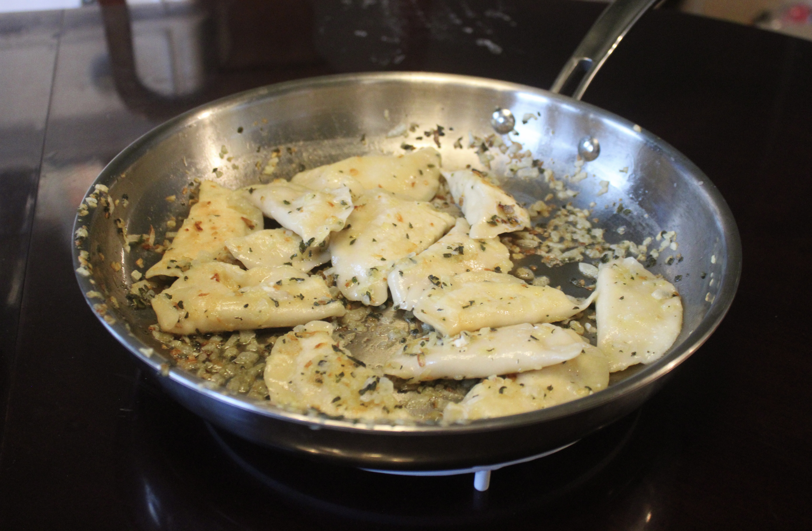
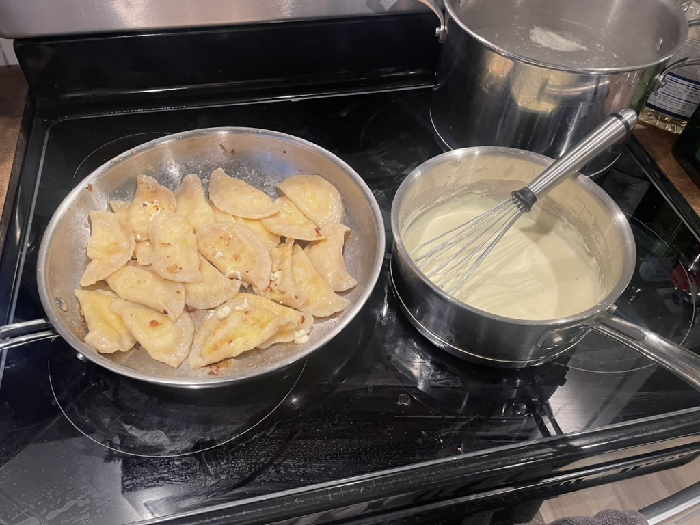

*A Dream of a Woman*, Casey Plett's collection of short stories centering trans women, was first recommended to me by a friend a few years ago. It sat on my reading list for a while, and when I finally worked through my backlog and it came time to read this one, I was unsure how to feel about it. *Another book about being trans?* I had recently read *Nevada*; *Detransition, Baby*; *Stag Dance*; *Females*; *Orlando*; *Gender/Fucking*; *Little Blue Encyclopedia*: most of which were overwhelming in their emotional intensity. I vividly remember reading the ending of *Nevada* at a cafe in Greenwich Village, silently screaming at the characters in the book. By then I was seeing transgender themes in other genres too; I read Mary Shelley's *Frankenstein*, after reading Susan Stryker's *My Words to Victor Frankenstein Above the Village of Chamounix*, and both remain my recommendation to anyone wanting to understand the feeling of being trans.

With all of this in my head, I reluctantly began *A Dream of a Woman*, and was greeted with a breath of fresh air. At the risk of appearing naive or cliché, I will say that these six stories (or five of them, anyway) are not about transness, despite all featuring transgender characters. They are about trans women going about their lives: mostly as white women in Canada, mirroring the author's own experiences. Where this book shines is in its ability to tap into the yearning of late-20s-early-30s trans women for a normal life. From the first story, *Hazel and Christopher*:

> If your early thirties can be a rebirth, after rebirth had, supposedly, already been part of your life, then any period of your life can bring renewal. Can’t it? I believe in that. One day, I had this clear feeling. We went to this diner that had just opened. They used all local ingredients, claimed we really didn’t have to tip, said they were proud to pay their workers an actual living wage. I had a sandwich with soft, thick bread, a kind of cheese I’d never heard of, and fresh greens, and coffee that was somehow so fucking good I didn’t even put cream in it. I’d paid for meals that nice before, but this was the first time I did it without any regret or anxiety. That was the special thing. And we drove home (he drove home), and I thought, I made it.

Parellel to this yearning runs the book's other primary theme: community. As Casey Plett points out in her essay *On Community*, *community* as a term has reached semantic satiation: it is repeated so often that it has lost its meaning. *A Dream of a Woman* offers a way to recover it, asking what the word could mean to different trans women at different stages of their lives. What do members of a community actually owe each other? Loosely, I read *A Dream of a Woman* as sorted from least to most developed sense of that responsibility: the early stories follow trans women too fatigued or unwilling to show up for their community, while the later ones depict women who have more defined opinions on what obligations we owe each other. 

The penultimate chapter, *Enough Trouble*, was my favorite story of the book, and perhaps one of my favorite trans stories I've ever read. Its protagonist is Gemma, a transgender woman who returns to her small, rural Mennonite hometown broke, hoping to stay with some trans women she loosely knows. She arrives to find her Manitoba city of 8,000 has constructed a 40+ story skyscraper, where most of the story takes place. The dissonance between the rural town and the tower gives the whole chapter a dreamy feeling (a dream of a woman?). In one of the most lucid sections of the book, Gemma walks through the steps to make Wareniki, a Mennonite dish she learned in her childhood. As the recipe proceeds, she reflects on her upbringing and on the role of community in queer and Mennonite culture: two communities that look nothing alike on the surface, and in which the author, undoubtedly speaking of her own experiences through Gemma, finds parallels. This monologue celebrates community's power to create a sanctuary of safety and comfort, but it also recoils at the power of the group to corrupt, and at the isolation that such a strong-community-oriented lifestyle can bring.

When I finished this book, its characters and themes lingered with me. Continuing through my reading list, I came to *Attensity*, which struck the same chord on community and the isolation of modern life:

> “We break bread together less, worship together less, engage in civic activities, clubs, and recreational communities with others less than ever. And the time we do spend with others, today, is pervasively permeated by our devices—which continuously pull each and every person away from IRL presence and active intersubjectivity and toward the screen-silos that separate each from each upon the surface of the good Earth. We have been scattered and isolated in this actual world, even as we have been thrown together in a new and simulacral tumbler, where, like pebbles worn smooth in a slurry of grit, we are ground down and ground up. Under these conditions, how do we put ourselves back together? It’s simple! The solution is embedded in the question: *We actually get together*.” 

I found myself moved by this, and as I was between jobs with time and energy to spare, I started a book club with some friends to foster a shared attention, *to actually get together*. After some discussion, we chose *A Dream of a Woman* as our first book. While discussing Gemma's Wareniki and her musings on community, my girlfriend proposed that the entire book is in fact just an elaborate introduction for a recipe. I took the bait: I recreated the recipe from Gemma's instructions and invited our book club over to share it. In *On Community*, Casey Plett writes that community is a verb; this book club and the Wareniki recipe were my small attempt to practice that idea.

## Mennonite Supper

<!-- "I could do a Menno supper.” The T1s have definitely kicked in. Gemma’s brain is a smooth lake. “Wareniki and Foamavorscht.” That’s Plautdietsch for perogies and sausage

Flour, butter, heavy cream. Cottage cheese, kernel corn, and—holy shit, by some heavenly fuckin’ miracle there is farmer sausage (Foamavorscht) at the fucking Giant Tiger  -->

<!-- Once, in Toronto, Gemma’d promised to make that roommate/lover a big pan of them. But she bought pastry flour not knowing the difference and ended up with a huge flavourless pile of dough holding tiny circles of filling -->

> "The way you made Wareniki was simple" - Gemma, *A Dream of a Woman*

My parents and grandparents had made perogies a few times when I was a child: dough folded into a pouch and stuffed with mashed potatoes, onions, or cheese. Wareniki is a Mennonite variation of these perogies I was familiar with. I wanted to be as faithful as possible to Gemma's recipe, but it left me some open degrees of freedom. The perogy dough was the hardest part to pin down, given its vagueness in the book's description and my inexperience with baking. I started by following Gemma's instructions explicitly (flour, water, salt, and baking powder), calling my parents for advice on how much of each to use. From there I kept iterating on the ratio and technique, batch after batch, until I had made about fifteen variations of Wareniki. My favorite used Gemma's dough and filling but swapped baking in butter for boiling and pan-frying with sage, onion, and browned butter. Still, the version truest to the book, Gemma's baked Wareniki with a [Schmaundt fat recipe from menno neechie kitchen](https://mennoneechiekitchen.com/index.php/2017/01/19/schmaundt-fat-cream-gravy/), was delicious in its own right, and that's the variation I chose to share with my book club. 

For anyone looking to make this themselves, I've reproduced Gemma's recipe steps from *A Dream of a Woman* in the blockquotes below, with my measurements in square brackets.

> "First, you make the perogy dough. Just use flour [2 cups] and water [~3/4 cup] to make a bunch of it (add a bit of salt [1/2 tsp] and baking powder [none], if you want). Make sure it’s not sticky. Chill it in the fridge for an hour. [leave at room temp; it becomes easier to roll]"
>
> "After that, you make the filling. There are lots of options, but you grew up with cottage cheese, and that’s what you are going to make. You take two big containers of the stuff [400 mL, left in a sieve for 30 min] and put it in a bowl. Stir in a few healthy dabs of salt and an egg [1 egg yolk], and then lots of pepper. You want enough pepper that the top is nearly solid black before you start mixing it in"
>
> "Next, preheat the oven to 350, and then roll out your dough. Make it thin [about 1/8″ thick]. Use a glass on a cutting board to cut out individual Wareniki and put the cottage cheese filling [about 1 teaspoon] in the centre. Make sure you don’t put too much; you want to be able to pinch it off clean when you close the dough. There, you have your first one. Repeat until you have enough to fill a baking pan."
>
> "Now you’re ready to bake. Some people boil, and some pan-fry, but your father baked Wareniki when he showed you how, and so you are going to bake. Take out your vodka, pour two shots [60 mL] into a pint glass, then fill the glass halfway with water and shoot it back, the liquid drawing bulky fingers through your throat, falling in glittering trails down your insides."
>
> "Melt a stick of butter, and then pour it into the baking pan. Put in the Wareniki, melt another stick of butter, and pour it over top. You’re ready to put them in the oven now. Set the timer for twenty minutes."
>
> "Believe it or not, you’re mostly done. You only have to cook the meat and make the sauce and heat up some vegetables and set the table, just in time for your hungry family to come inside and sit down."

<!-- 
Variations tested and notes:
v1: quarter batch of gemma's dough - dough consistency was too dry, not rolled thin enough, some were closed, but others were open
v2: quarter batch of menno neechie's dough - wouldn't roll thin, got very crispy and tough in the oven, easy to make though, too thick and did not crimp very well so they were open
v3: quarter batch of gemma's dough - rolled thin, but second rolling was harder to get thinner, extra butter from baking used to pan fry, need more filling than 1 tsp and less heavy cream
v3.1: baked 15, 17.5, 20 min, brushed with butter (baked 17.5 min best)
v3.1.1: baked 15, 17.5, 20 min then pan fried (pan fried better except 20 min baked)
v3.2: boiled, at 2, 3, 4 min (3-4 min best)
v3.2.1: boiled 2, 3, 4 min then pan fried (pan fried always better)
v4: half batch of gemma's dough, boiled floating + 1 min then pan fry, curds were dried and heavy cream omitted, cooked with sage+onion+butter
v5: full batch of gemma's dough, baked + schmaundt fat -->