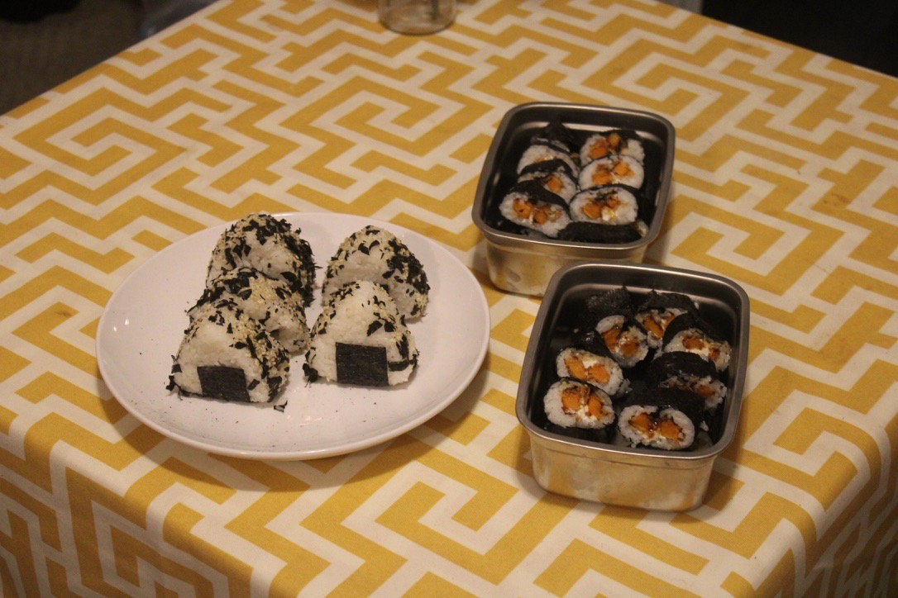
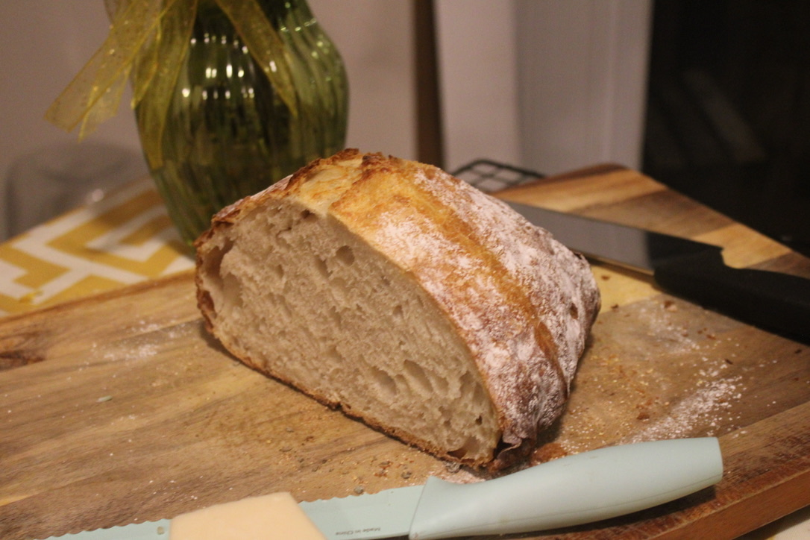
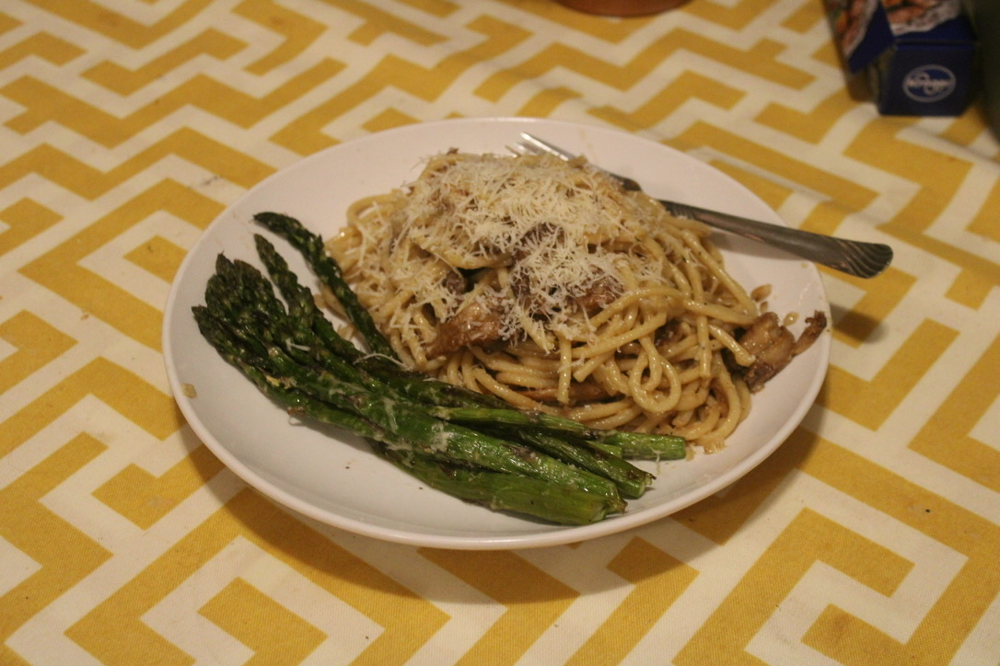
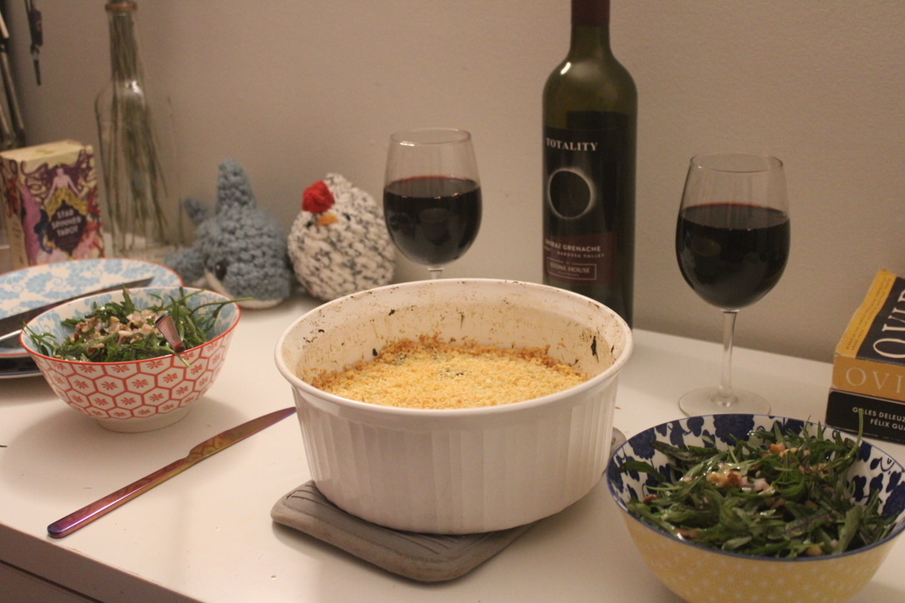
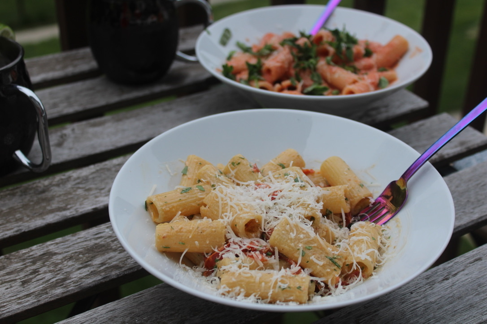
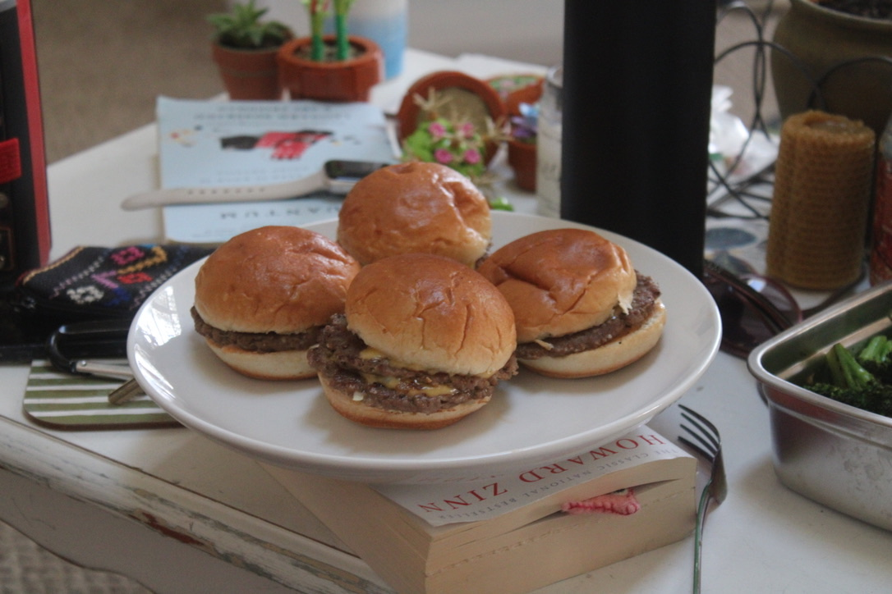

At this point in my life, I feel incredibly happy and grateful. I have an amazing, loving girlfriend, I've secured my dream job, my ongoing health issues have been improving, and I'm spending the summer traveling the US to visit friends and family. I believe a huge contributor to this joy is that I've been fortunate enough to take the last six months off from work while I searched for my next career move. After about thirty applications, I received an offer from my top pick: a postdoctoral fellowship at the Federal Institute for Materials Research and Testing in Berlin, Germany, to work on autonomous materials discovery for environmental remediation. This is the type of work that I've dreamed of doing for years: intellectually challenging, consistent with my values of sustainability and open science, and enough compensation to pay the bills. As I'm incredibly grateful to be at this point, I'd like to reflect on what I did during my break from academia to get me here.

Put simply, I've used this time to pursue what the stress of graduate school had kept from me. I started off this break extremely productively, with the momentum of graduate school carrying me. In these months, I:

- learned guitar, and played more bass, cello, and piano
- removed a trove of old big tech data and accounts, set up RSS feeds for media consumption, and made several strides towards self-hosting
- went camping for the first time in years, and visited a few state and national parks
- traveled to NYC (x2), Boston, Chicago, Austin, Philadelphia, and in a few weeks I'll be going to Los Alamos
- downsized much of my clothing and possessions in preparation for a move to Europe
- vibe-coded several projects, my favorite being [this local TODO system](https://github.com/katnykiel/scrumtui) which will eventually get its own post
- got back into running and volleyball, and relieved chronic issues I picked up during graduate school
- started a book club

All of these pursuits have been great for my mental and physical health. However, this break hasn't been without trial. As the months dragged on, I felt unmoored as I realized how critical the stable identity of *graduate student* had been to me, and I struggled to fill my days with activities to derive meaning. In my experience, the identity of a graduate student was a warm blanket to insulate me from a cold world. I felt a persistent sense that being a graduate student meant bettering myself and pursuing a passion. This was reinforced by those around me who treated the title as something worthy of admiration. After graduating, I no longer felt that insulation. This was especially true as I went through my job search, and as the rejections piled up I felt that it all may have been in vain. This was somewhat alleviated when I received my top offer. I was disconcerted by how strongly this influenced my sense of self, and I think that more reflection is needed to decouple my work from my identity.

To end on a lighter note, I think that my favorite endeavor on my hiatus has been to refine my culinary skills! As a vegetarian (and often vegan), I've been cooking for myself for years, and I've historically considered myself to be a decent cook. However, faced with a multitude of empty days ahead of me, I decided to dedicate more time to cooking and pick up those skills which have eluded me. In this time, I:

- worked on my knife skills
- learned how to *properly* mince garlic
- learned how to use a stainless steel pan to make golden tofu or perfect fried eggs
- perfected some staple sauces to my taste, like teriyaki, which I can throw on a variety of dishes
- began to use more of what's in my pantry to build meals, instead of just following recipes

That said, I should also mention that I leaned heavily on America's Test Kitchen's *Vegetarian Cookbook* and Deborah Madison's *Vegetarian Cooking for Everyone*. I've shared the results of some of my favorite recipes from these books (and elsewhere) below. Enjoy! 

Sushi! I did my best to imitate a local sushi restaurant by roasting some sliced sweet potatoes, then coating in panko breadcrumbs and frying to get them nice and crispy. With some cream cheese and teriyaki, it is absolutely delicious and my girlfriend's favorite dish of mine. She made some onigiri!

My first sourdough! I had this with some lovely leek and potato soup from America's Test Kitchen's vegetarian cookbook. 

This lion's mane pasta with roasted asparagus remains my favorite dish I've ever made. I found the mushrooms at a local farmers market, and I followed a recipe from [Table for Two](https://www.tablefortwoblog.com/lions-mane-mushroom-recipe/) to sauté in thyme and butter in batches. This photo doesn't do the dish justice. 

An eggplant and summer vegetable gratin alongside an arugula salad with pecorino romano and toasted walnuts, both from Deborah Madison's vegetarian cookbook.

My girlfriend and I made each other pasta dishes to use up some extra rigatoni! I made her pasta alla vodka, using a [NYTimes recipe](https://cooking.nytimes.com/recipes/1019924-pasta-alla-vodka), while she made a variation of the Fettuccine and Sautéed Peppers with Parsley (from Madison's cookbook) with garlic mayonnaise.

Most recently, I made some White Castle copycat sliders using [America's Test Kitchen's recipe](https://www.americastestkitchen.com/articles/5236-how-to-make-copycat-white-castle-burgers), substituting Impossible meat for ground beef. These were delicious and quite fun to make.

Not pictured: I've been using [this recipe](https://www.americastestkitchen.com/recipes/7730-tex-mex-cheese-enchiladas) from America's Test Kitchen to make tex-mex enchiladas at least once a week, and it has become one of my favorite dishes to make. The ratio of deliciousness to time investment is higher for this than any of the other dishes I've made.
