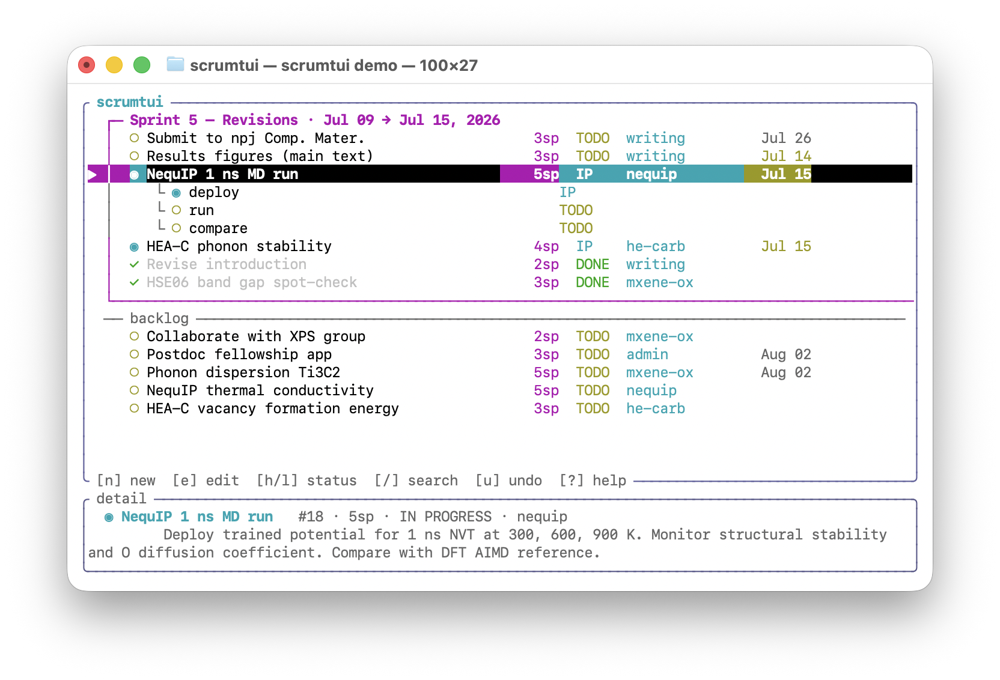
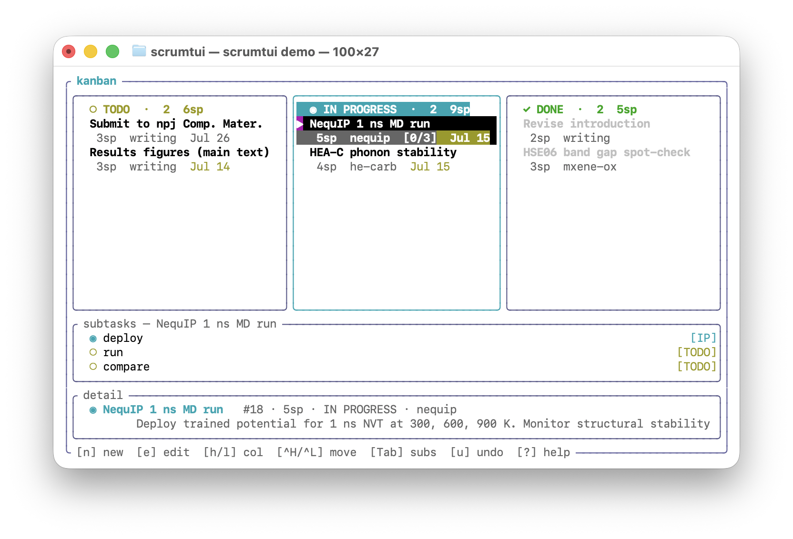
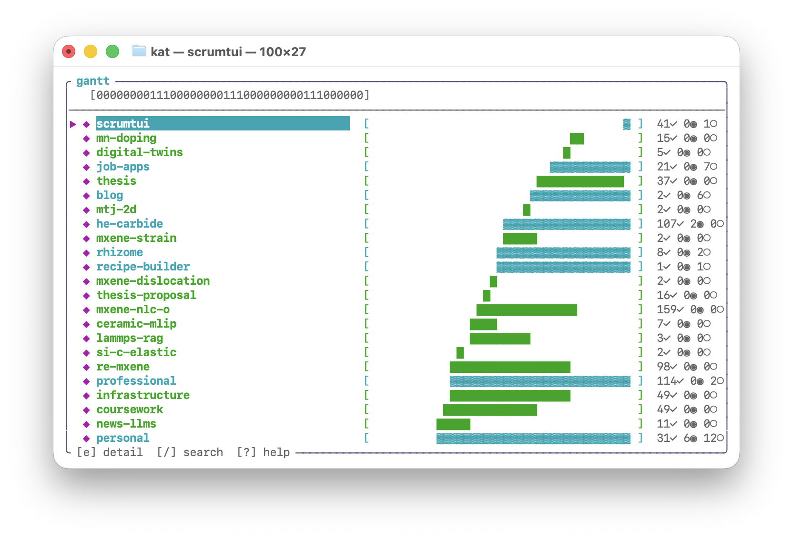
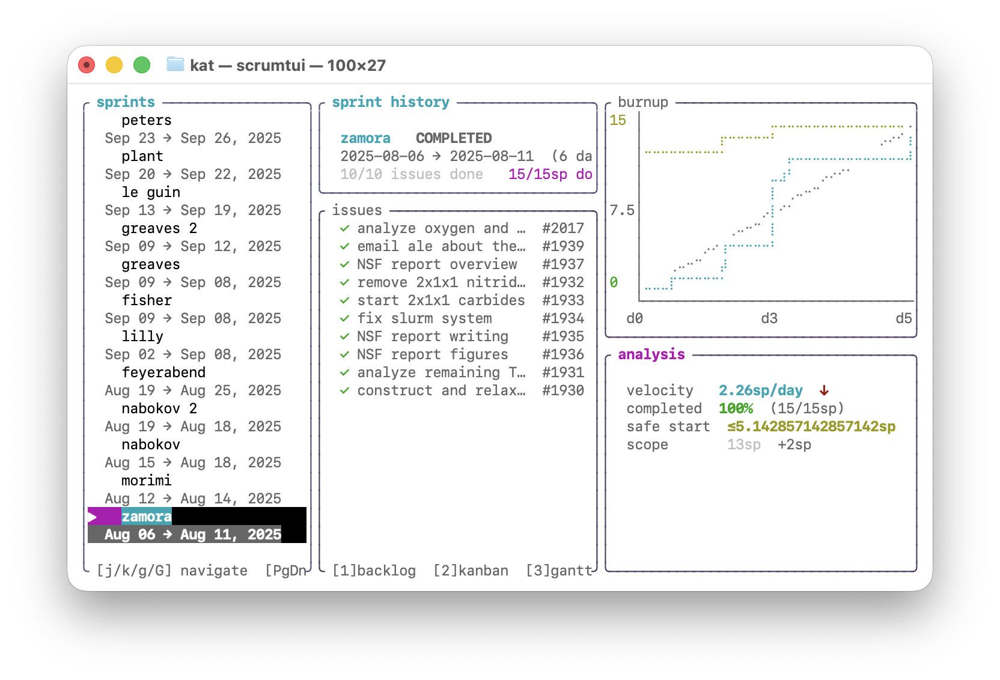

A few years ago, a colleague proposed to me that research, at its core, is an exercise in information organization. They believed that doing high quality research via the process of reading papers, performing experiments, and publishing results does not require talent or focus, but rather organization. Unable to evaluate the veracity of this claim at that point of my PhD, I took it to heart, and have spent a perhaps inordinate amount of my time on organization. I hope that [my past post](./a-phd-in-data) on the data I collected throughout my PhD lends some evidence to this. 

One avenue of organization I devoted a lot of thought to was how I should keep track of the work I need to do. Some people use sticky notes, pen-and-paper TODO lists, or specialized apps. For a while, I used a digital TODO list (read: a markdown file), but it became overwhelming as issues piled up and I became unable to distinguish what work I needed to prioritize. After exploring other systems, I finally landed on scrum. Put simply, scrum is a project management system where work is broken down into tasks, which are completed within time-boxed iterations, called *sprints*. There's a lot of jargon in scrum, but to keep it simple:

- *sprints* are week- or month-long periods of focused work
- *issues* are the individual tasks, usually 1–2 hours of deep work
- *backlog* is the list of issues

For example, once a week I selected the *issues* of highest priority from my *backlog*, grouped them into a *sprint*, and then dedicated the week only to those issues and any urgent issues that arose. While distributed scrum in industry settings can often serve as a method for product managers to overwork and stifle their employees, I've found that single-person scrum works extremely well for managing my research. Specifically, the act of planning out the work I intended to do each week and checking in each morning over coffee or tea greatly helped focus my priorities for the day.

I started by using Jira for scrum, as they offer a generous free cloud service. The cloud aspect bothered me, as did the slowness and gross number of features, but I was unable to find any comparable local alternatives. Many of the local options were overkill for my use case, given that it's just one-person scrum. Eventually, I decided to vibe-code a solution, with the following requirements:

- local (no data stored in the cloud)
- TUI (cleaner UI)
- minimal (easier to use and debug)
- vim keybinds (no mouse needed)
- Rust (fast and safe)
- feature parity with everything I used in Jira (backlog, kanban, epic, and sprint history views)

After a few weeks of development, I feel comfortable sharing this for others to use. It's primarily been tested on macOS, NixOS, and Arch, but it should generally work anywhere Rust is installed. I've shared some screenshots of the four views below, with the first two using demo data and the latter two using historical Jira data I've imported into this system.

