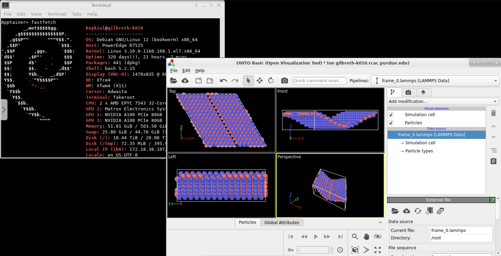

When rendering visualizations of large systems in our group, we often use [Ovito](https://www.ovito.org/), running on an Intel Mac in our office space. This seems a little strange, given that we have large amounts of high-performance computing resources at our disposal. Here's a quick demo of how we can set up Ovito to run on a remote system. More generally, this is a demo of how to install any tricky-to-compile software, whether it be due to permission errors, missing dependencies, or out-of-date distributions.

If you just want to get Ovito running, skip to "[Using an Ovito image](https://katnykiel.github.io/docs/strachan-lab/ovito-apptainer/#using-an-ovito-image)".

## Building a New Image

First, we pull and build a sandboxed [Apptainer](https://apptainer.org/) image of a distribution that makes compilation easy. Here, I use [Debian 12](https://www.debian.org/). In our remote system with Apptainer, we run the following to pull the latest Debian image from [Docker](https://www.docker.com/).

```zsh
apptainer build --fakeroot --sandbox ovito-test/ docker://debian
```

After this builds, we can connect to the image using fakeroot:

```zsh
apptainer shell --fakeroot --writable ovito-test/
```

Once inside, we can start to compile Ovito (or another software) in this compatibility layer where we have more flexibility. For Ovito, copy the `.tar.xz` archive from the Ovito website to the clusters, and then extract using `tar`. In this case, we'll also need to install `xz-utils` to extract the Ovito image. 

```shell
apt install xz-utils
tar xJfv ovito-basic-3.11.3-x86_64.tar.xz 
```

We will also have to install a few XCB system libraries (below is an accumulation from Ovito's documentation and my own testing, all are probably not necessary). I have found that compiling in [ThinLinc](https://www.cendio.com/thinlinc) avoids some of these issues.

```zsh
apt install libxcb1 libx11-xcb1 libxcb-glx0 libxcb-icccm4 libxcb-image0 libxcb-keysyms1 \
         libxcb-randr0 libxcb-render-util0 libxcb-render0 libxcb-shape0 libxcb-shm0 \
         libxcb-sync1 libxcb-xfixes0 libxcb-xinerama0 libxcb-xinput0 libxcb-xkb1 libxcb-cursor0 \
         libfontconfig1 libfreetype6 libopengl0 libglx0 libx11-6
apt-get install libegl1-mesa libegl1 libglib2.0-0
```

Ovito is now compiled, with all of its dependencies! Congrats.

## Using an Ovito Image

I've created a working version of this Ovito implementation and left it in `/depot/prism/data/knykiel/ovito-test`. The following commands will get you up and running quickly if you don't care to set up your own Apptainer image.

1. Login with ThinLinc at <https://desktop.gilbreth.rcac.purdue.edu:300/> to obtain a persistent remote graphical desktop session, and open up a terminal.

2. Submit an interactive job - it'll be faster, and you won't waste front-end resources:

```zsh
sinteractive -A strachan-k -N1 -n32 --gpus-per-node=1 --time 04:00:00
```

3. Start a shell in the Ovito image on depot:

```zsh
cd /depot/prism/data/knykiel
apptainer shell --fakeroot --writable /depot/prism/data/knykiel/ovito-test/
```

4. Run Ovito:

```zsh
./ovito-basic-3.11.3-x86_64/bin/ovito
```


